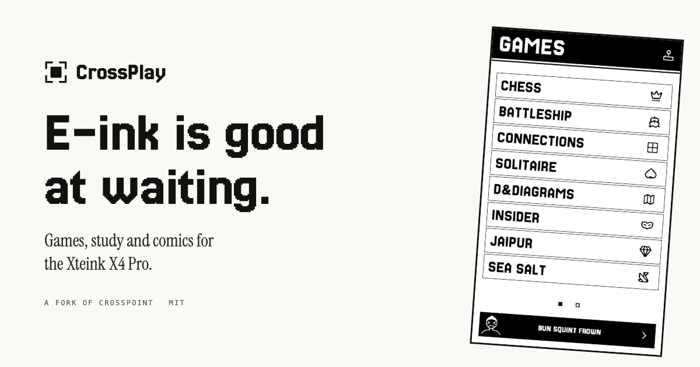

<h1 align="center">
  <br>
  CrossPlay
</h1>

<p align="center">
  <strong>E-ink is good at waiting.</strong><br>
  So is a chess position, a flashcard, a puzzle you are halfway through.
</p>

<p align="center">
  <a href="https://github.com/ma-r-s/crossplay/releases">Releases</a> &middot;
  <a href="docs/shelf.md">What is on it</a> &middot;
  <a href="docs/identity.md">Identity</a> &middot;
  <a href="LOCAL_SCOPE.md">Scope</a>
</p>

<p align="center">
  <a href="https://github.com/ma-r-s/crossplay/actions/workflows/crossplay-ci.yml"></a>
</p>



CrossPlay is a fork of [CrossPoint](https://crosspointreader.com/) for the
**Xteink X4 Pro**. CrossPoint turns the device into an excellent e-reader.
CrossPlay keeps all of that and adds the other things a screen that holds still
is good at: games you think about rather than react to, spaced-repetition
flashcards, comics, and two devices that play together with nothing to set up.

It is a personal fork, built in the open. Upstream lands on a `base` branch and
is merged in continuously. The reading side is CrossPoint's and stays CrossPoint's:
the EPUB engine, sync and the file browser are theirs, and the reader's chrome is
restyled to match the design language the apps use.

## What is on it

|                  |                                                                             |
| ---------------- | --------------------------------------------------------------------------- |
| **Chess**        | A full engine on the device, or a board between two of them.                |
| **Battleship**   | Lay out a fleet, then hunt someone else's.                                  |
| **Connections**  | The daily word grid, with an archive of past boards.                        |
| **Solitaire**    | Klondike, turned sideways because that is the shape of a tableau.           |
| **D&Diagrams**   | A nonogram whose clues are a dungeon. 64 of them.                           |
| **Insider**      | A party game for a table and one device.                                    |
| **Jaipur**       | The two-player trading game, solo or nearby.                                |
| **Murdle**       | A logic grid built through the solver, so you never have to guess.          |
| **Checkers**     | English draughts, where taking is compulsory and the board says so.         |
| **Connect Four** | Drop a disc, get four in a line. Seven columns, one tap each.               |
| **Yahtzee**      | Thirteen boxes, three rolls a turn, and the Joker rules in full.            |
| **Knucklebones** | Cult of the Lamb's dice game. Matching dice multiply; yours destroy theirs. |
| **Minesweeper**  | Tap to dig, hold to flag. The first dig is always safe.                     |
| **Sea Salt**     | Sea Salt & Paper: collect duos, bet on STOP or LAST CHANCE.                 |
| **Toy Battle**   | Nine boards of bases and paths. Hold regions, take medals, solo or nearby.  |
| **Study**        | Anki decks with the FSRS scheduler, offline.                                |
| **Hacker News**  | The front page in a reading serif, articles kept on the card.               |
| **xkcd**         | The archive, packed for the card and drawn one to one.                      |

Chess, Battleship, Jaipur, Knucklebones, Checkers, Connect Four, Yahtzee and
Sea Salt and Toy Battle play
over **PLAY NEARBY**: put two devices next to
each other and they find one another. No pairing screen, no room code, no
account, no router, no internet.

Each game's rules, its state machines and the decisions behind them:
[Checkers](docs/apps/checkers.md) &middot;
[Connect Four](docs/apps/connectfour.md) &middot;
[Yahtzee](docs/apps/yahtzee.md) &middot;
[Knucklebones](docs/apps/knucklebones.md) &middot;
[Minesweeper](docs/apps/minesweeper.md) &middot;
[Jaipur](docs/apps/jaipur.md) &middot;
[Sea Salt](docs/apps/seasalt.md) &middot;
[Murdle](docs/apps/murdle.md) &middot;
[Toy Battle](docs/apps/toybattle.md).
How the two physical buttons are used, and why there are only two:
[buttons](docs/buttons.md).

## Install it

CrossPlay targets the **Xteink X4 Pro** only. For every other supported device,
CrossPoint upstream is the right answer and is excellent.

> **This runs on real hardware.** One tester flashed v1.2.1 and played most
> of the shelf; the three problems they hit were fixed in v1.2.2. As of
> v1.3.0 I have an X4 Pro of my own on the desk, so releases are flashed
> here before they ship. Two devices is still a small record: if you flash
> it, please
> [say what happened](https://github.com/ma-r-s/crossplay/issues), either way.

You do not need to have installed CrossPoint first.

1. Download `crossplay-<version>-x4pro-full.bin` from the
   [releases page](https://github.com/ma-r-s/crossplay/releases). That is the
   whole firmware: second-stage bootloader at `0x0`, partition table at
   `0x8000`, application at `0x10000`, in one file.
2. Plug the device into a computer over USB.
3. Install [esptool](https://github.com/espressif/esptool) if you have not
   (`pip install esptool`, same on Windows, macOS and Linux) and run:

   ```bash
   esptool.py --chip esp32s3 --baud 921600 write_flash 0x0 crossplay-<version>-x4pro-full.bin
   ```

### Updating an install you already have

The release also carries `firmware.bin`, which is the application on its own.
That is the file for a device that already has a bootloader, and it needs no
cable: **Settings -> Check for updates** fetches it over Wi-Fi, or you can copy
it onto the SD card and choose it from the same screen. The updater matches that
exact filename, so do not rename it.

`-full.bin` is for the USB install only. Do not hand it to the on-device
updater: that would be writing a bootloader into a slot meant for the
application.

Two things worth knowing before you start:

- **`--chip esp32s3`, and only the X4 Pro.** The X4 and X3 are ESP32-C3. This
  binary is not for them and flashing it there is a cross-chip flash. Install
  [CrossPoint](https://crosspointreader.com/) on those instead: it is excellent
  and it is what this is built on.
- **Flashing replaces the firmware, not the SD card.** Your library, your
  reading positions and your fonts are files on that card and are left alone.
  Installing stock CrossPoint over the top puts the device back where it was,
  which makes this cheap to try. If a flash goes wrong,
  [docs/fix-bricked-xteink.md](docs/fix-bricked-xteink.md) is the way back.

## Try it without a device

[**crossplay.ma-r-s.com**](https://crossplay.ma-r-s.com) runs the real firmware
in the browser: the same `src/` and `lib/` the device build compiles, put
through `em++` instead of `g++`, against an SD card of its own. Click the screen
in the hero, or ask for two devices and watch them find each other.

The browser build fakes three things, all documented in
[site/README.md](site/README.md): the network answers from a snapshot, Study's
headword font is the small cut under the big one's name, and sleep is off.

## Build it

```bash
pio run -e x4pro                 # the firmware
pio run -e simulator_x4_pro      # a desktop simulator, SDL2 + a FreeRTOS shim
./scripts_local/check.sh         # host tests and both builds
```

Every suite green is the only green; nothing is a known failure.

The apps live in `src/apps_local/`, which is what keeps the merge with upstream
close to conflict-free. It is not the whole diff: the settings screens, the
reader's menus and parts of `lib/` are reworked too, and those are where a merge
conflict will come from if one does. Read
[LOCAL_SCOPE.md](LOCAL_SCOPE.md) and [docs/shelf.md](docs/shelf.md) before
adding anything, and [docs/building-apps.md](docs/building-apps.md) for how an
app is put together.

## The website

`site/` is static: the landing page, the [Study deck
installer](https://crossplay.ma-r-s.com/study/) (Pyodide converting Anki decks
in the browser, previewed on the real firmware), their stylesheet and scripts,
the assets they name, and the browser build under `site/emulator/`. See
[site/README.md](site/README.md) for how to serve it (a plain `http.server`
will not do, the threads need COOP/COEP) and what has to be true before it
deploys.

## Credit and licence

CrossPlay is MIT, like the project it forks, and it is a fork in git's sense as
well as in the README's: this repository is a GitHub fork of
[crosspoint-reader/crosspoint-reader](https://github.com/crosspoint-reader/crosspoint-reader),
shares its commit history, and merges every upstream release rather than
re-implementing it. It stands on
[CrossPoint](https://github.com/crosspoint-reader/crosspoint-reader) and the
[FreeInk SDK](https://freeink.org/); upstream's own README is kept at
[docs/crosspoint-readme.md](docs/crosspoint-readme.md).

xkcd comics are by Randall Munroe, [CC BY-NC 2.5](https://xkcd.com/license.html),
fetched by the device from [xkcd.com](https://xkcd.com). Connections puzzles are
the New York Times'; CrossPlay ships none of them and downloads only what you
ask for. Type is Jersey 25 and Instrument Serif, both SIL OFL.

Jaipur, Insider, Murdle, Battleship, Connections, Knucklebones, Sea Salt &
Paper and Toy Battle are trademarks of their respective owners. Sea Salt & Paper
was designed by Bruno Cathala and Theo Riviere and is published by Bombyx. Toy
Battle was designed by Paolo Mori and Alessandro Zucchini and is published by
Repos Production. CrossPlay implements the games; it is not affiliated with,
endorsed by or sponsored by any of them.

Reading positions sync to CrossPoint's own server by default. That is
upstream's infrastructure rather than this fork's, inherited so that flashing
CrossPlay over CrossPoint does not orphan an existing sync; the address is a
setting and can be pointed at any KOSync server.

## r8 Xteink X4 sibling build

This custom tree also provides an original Xteink X4 target. See `X4_BUILD.md`.
Use PlatformIO environment `x4_r8` for X4 (ESP32-C3) and `x4pro_r8` for X4 Pro (ESP32-S3).

## r10 performance build
For the streamlined X4/X4 Pro workflow and faster incremental builds, see `R10_BUILD.md`.
